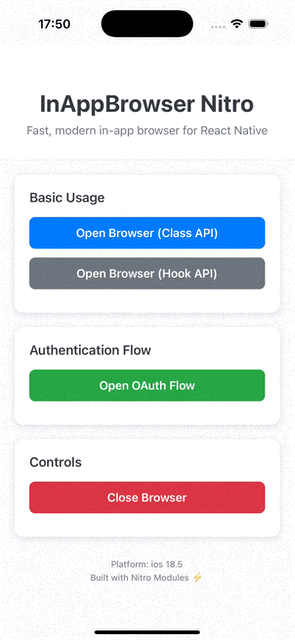

# react-native-inappbrowser-nitro

[](https://www.npmjs.com/package/react-native-inappbrowser-nitro)
[](https://www.npmjs.com/package/react-native-inappbrowser-nitro)
[](LICENSE)

Lightning-fast, modern in-app browser for React Native powered by Nitro Modules. Enjoy direct JSI bindings, zero bridge overhead, and polished native browser UX on both iOS and Android.

<div align="center">
  
</div>

## Contents

- [Highlights](#highlights)
- [Platform Support](#platform-support)
- [Installation](#installation)
- [Usage](#usage)
- [Migration Guide (pre-Nitro → latest)](#migration-guide-pre-nitro--latest)
- [API Surface](#api-surface)
- [Options Reference](#options-reference)
- [Dynamic Color Palettes](#dynamic-color-palettes)
- [Security & Emulator Notes](#security--emulator-notes)
- [Troubleshooting](#troubleshooting)
- [Contributing](#contributing)
- [License](#license)

## Highlights

- TurboModule-first implementation with native-speed execution and zero bridge overhead.
- Fully typed TypeScript API plus ergonomic React hook helpers.
- ✅ **iOS 26 ready**: high-contrast dynamic colors, edge-dismiss control, and UI style overrides.
- ✅ **Android 16 ready**: partial custom tabs, referrer controls, and per-theme palettes.
- Authentication-first design with ephemeral sessions and graceful fallbacks.
- Works great with Hermes, Fabric, and the React Native New Architecture.

## Platform Support

| Platform | Minimum | Targeted | Highlights |
|----------|---------|----------|------------|
| iOS | 11.0 | 17 / 26* | SafariViewController + ASWebAuthentication support. |
| Android | API 23 | API 34 / 16* | Chrome Custom Tabs with dynamic theming. |
| React Native | 0.70.0 | Latest | Nitro Modules + TypeScript bindings. |

\* iOS 26 and Android 16 features are automatically gated behind runtime checks.

> **Expo** is not supported because Nitro modules require native compilation.

## Android Browser Fallback

<details>
<summary>Browser selection logic on Android</summary>

On Android, the library prioritizes Chrome Custom Tabs for the best user experience when Chrome is installed. If Chrome is not available (e.g., on Samsung devices), it falls back to opening the URL in the device's default web browser using the standard `Intent.ACTION_VIEW` mechanism.

This ensures compatibility across devices while maintaining optimal performance with Chrome when possible.
</details>

## Installation

```sh
npm install react-native-inappbrowser-nitro react-native-nitro-modules
```

or

```sh
yarn add react-native-inappbrowser-nitro react-native-nitro-modules
```

### iOS

```sh
cd ios
pod install
```

### Android

No additional steps—Gradle autolinking handles everything.

## Usage

### Imperative API

```tsx
import { InAppBrowser } from 'react-native-inappbrowser-nitro'

async function openDocs() {
  if (!(await InAppBrowser.isAvailable())) {
    console.warn('No compatible browser found')
    return
  }

  const result = await InAppBrowser.open('https://nitro.margelo.com', {
    preferredBarTintColor: { base: '#111827', light: '#1F2933', highContrast: '#000000' },
    preferredControlTintColor: { base: '#F9FAFB', highContrast: '#FFD700' }, // iOS 26+
    toolbarColor: { base: '#2563EB', dark: '#1E3A8A' },
    enablePartialCustomTab: true, // Android 16+
  })

  console.log(result)
}
```

### React Hook

```tsx
import { useInAppBrowser } from 'react-native-inappbrowser-nitro'

export function LaunchButton() {
  const { open, isLoading, error } = useInAppBrowser()

  return (
    <Button
      title={isLoading ? 'Opening…' : 'Open Browser'}
      onPress={() => open('https://github.com/mCodex/react-native-inappbrowser-nitro')}
      disabled={isLoading}
      color={error ? 'crimson' : undefined}
    />
  )
}
```

### Authentication Flow (OAuth / SSO)

```tsx
const result = await InAppBrowser.openAuth(
  'https://provider.com/oauth/authorize?client_id=abc',
  'myapp://oauth/callback',
  {
    ephemeralWebSession: true,
    enableEdgeDismiss: false, // iOS 26+: lock swipe-to-dismiss during auth
    showTitle: false,
  }
)

if (result.type === 'success' && result.url) {
  // handle redirect
}
```

## Migration Guide (pre-Nitro → latest)

Migrating from earlier `react-native-inappbrowser-nitro` versions? Note these key changes when adopting the Nitro rewrite:

### 1. `open()` resolves on presentation

Older releases resolved the promise when the browser closed. The new implementation resolves as soon as Safari/Custom Tabs is shown (mirroring Android behavior), and dismissal status is delivered asynchronously.

```diff
-const result = await InAppBrowser.open(url, options)
-// resolved after the tab closes
-console.log(result.type)
+const result = await InAppBrowser.open(url, options)
+console.log('Browser visible', result.type)
+// move teardown logic to listeners triggered on dismiss
```

If you depended on awaiting dismissal, refactor to handle completion via deep links, event listeners, or the returned result object.

### 2. Options now use structured colors and new flags

- Color props accept `DynamicColor` objects to describe light/dark/high-contrast palettes.
- Added platform guards such as `enableEdgeDismiss` (iOS 26), `enablePartialCustomTab`, `includeReferrer`, and `shareState`.
- TypeScript enums/constants are exported from the root for stronger typing.

```diff
-InAppBrowser.open(url, { toolbarColor: '#6200EE' })
+InAppBrowser.open(url, { toolbarColor: { base: '#6200EE', dark: '#3700B3' } })
```

### 3. Prefer the hook for loading/error handling

`useInAppBrowser` wraps the imperative API with loading state and error capture, aligning with the new async semantics.

```diff
-const handleOpen = () => InAppBrowser.open(url)
+const { open, isLoading, error } = useInAppBrowser()
+const handleOpen = () => open(url)
```

### 4. Regenerate bindings after upgrading

Run `yarn codegen && yarn build` (or your project script) to regenerate Nitro bindings so the new enums and options are available on both platforms.

## API Surface

| Method | Description |
|--------|-------------|
| `isAvailable()` | Resolve to `true` when a compliant custom tab / Safari controller is available. |
| `open(url, options?)` | Launch an in-app browser session with rich customization. |
| `openAuth(url, redirectUrl, options?)` | Open an OAuth/SSO flow that resolves once the redirect URL is reached. |
| `close()` | Programmatically dismiss an open browser session. |
| `closeAuth()` | Abort an authentication session. |

All functions return Promises and are fully typed. See `src/core/InAppBrowser.ts` for the higher-level wrapper implementation.

## Options Reference

### Cross-platform (`InAppBrowserOptions`)

| Option | Type | Notes |
|--------|------|-------|
| `headers` | `Record<string, string>` | Additional request headers applied to the first navigation. |

### iOS (`InAppBrowserIOSOptions`)

| Option | Type | Default | Notes |
|--------|------|---------|-------|
| `dismissButtonStyle` | `'done' \| 'close' \| 'cancel'` | `'done'` | Choose a Safari dismiss button style. |
| `preferredBarTintColor` | `DynamicColor` | System | Navigation bar background; honors `highContrast` on iOS 26+. |
| `preferredControlTintColor` | `DynamicColor` | System | Bar button tint; supports `highContrast` on iOS 26+. |
| `preferredStatusBarStyle` | `'default' \| 'lightContent' \| 'darkContent'` | System | Override status bar text color when available. |
| `readerMode` | `boolean` | `false` | Attempt Safari Reader mode. |
| `animated` | `boolean` | `true` | Toggle presentation animations. |
| `modalPresentationStyle` | `ModalPresentationStyle` | `'automatic'` | UIKit modal presentation style. |
| `modalTransitionStyle` | `ModalTransitionStyle` | `'coverVertical'` | Use `'partialCurl'` only with `'fullScreen'`. |
| `modalEnabled` | `boolean` | `true` | Present modally instead of pushing. |
| `enableBarCollapsing` | `boolean` | `false` | Allow Safari toolbar to collapse on scroll. |
| `ephemeralWebSession` | `boolean` | `false` | Use ASWebAuthenticationSession ephemeral mode. |
| `enableEdgeDismiss` | `boolean` | `true` | iOS 26+: enable or block interactive swipe-to-dismiss. |
| `overrideUserInterfaceStyle` | `'unspecified' \| 'light' \| 'dark'` | `'unspecified'` | Force Safari appearance regardless of system theme. |
| `formSheetPreferredContentSize` | `{ width: number; height: number }` | UIKit | Preferred size for form-sheet presentations (iPad). |

### Android (`InAppBrowserAndroidOptions`)

| Option | Type | Default | Notes |
|--------|------|---------|-------|
| `showTitle` | `boolean` | `true` | Toggle title text. |
| `toolbarColor` | `DynamicColor` | Browser default | Supports per-scheme colors & `highContrast` (Android 16+). |
| `secondaryToolbarColor` | `DynamicColor` | Browser default | Secondary toolbar background. |
| `navigationBarColor` | `DynamicColor` | OS default | API 27+. |
| `navigationBarDividerColor` | `DynamicColor` | OS default | API 28+. |
| `enableUrlBarHiding` | `boolean` | `false` | Hide URL bar on scroll. |
| `enableDefaultShare` | `boolean` | `false` | Deprecated alias for `shareState`. |
| `shareState` | `'default' \| 'on' \| 'off'` | `'default'` | Control the share sheet button. |
| `colorScheme` | `'system' \| 'light' \| 'dark'` | `'system'` | Hint to Custom Tabs theme. |
| `headers` | `Record<string, string>` | `{}` | Additional request headers. |
| `forceCloseOnRedirection` | `boolean` | `false` | Close once the URL changes. |
| `hasBackButton` | `boolean` | `false` | Replace close `X` with a back arrow. |
| `browserPackage` | `string` | Auto | Force a Custom Tabs provider package. |
| `showInRecents` | `boolean` | `true` | Hide or show the tab in Android recents. |
| `includeReferrer` | `boolean` | `false` | Attach `Intent.EXTRA_REFERRER`; may be ignored on emulators. |
| `instantAppsEnabled` | `boolean` | `true` | Allow Instant Apps fallback. |
| `enablePullToRefresh` | `boolean` | `false` | Enable built-in swipe-to-refresh. |
| `enablePartialCustomTab` | `boolean` | `false` | Android 16+: open in resizable bottom-sheet style tab. |
| `animations` | `{ startEnter?: string; startExit?: string; endEnter?: string; endExit?: string }` | System | Animation resource names from your app. |

## Dynamic Color Palettes

Provide adaptive color schemes without branching per platform by supplying a `DynamicColor` object:

```ts
type DynamicColor = {
  base?: string
  light?: string
  dark?: string
  highContrast?: string // iOS 26 & Android 16 accessibility override
}
```

When `highContrast` is given, the native layer only applies it when the OS signals increased contrast; earlier versions gracefully fall back to `base`/`light`/`dark`.

## Security & Emulator Notes

- **Auth hardening**: combine `ephemeralWebSession` with `enableEdgeDismiss: false` to keep OAuth flows contained on iOS 26+.
- **Referrer propagation**: `includeReferrer` improves attribution on Android but some emulator images lack Play Services and ignore it.
- **Partial tabs**: on emulators without gesture navigation the resize handle might be hidden; use the hardware back button to exit.
- **Device parity**: verify flows on real hardware—emulators often skip hardened browser checks present on production devices.

## Troubleshooting

### Android emulator says "InAppBrowser is not available"

- Install Chrome or another Custom Tabs capable browser via the Play Store.
- If none is available, the library falls back to the system chooser and surfaces the underlying error.

### iOS simulator quirks

- Safari View Controller has reduced capabilities (no Apple Pay, limited Reader mode).
- Use a device to validate privacy indicators, dynamic color, and high-contrast modes.

## Contributing

Pull requests and bug reports are welcome! Please read our [contributing guide](CONTRIBUTING.md) and run `yarn codegen && yarn lint` before submitting changes.

## License

MIT © [mCodex](LICENSE)

---

Built with ❤️ using [Nitro Modules](https://nitro.margelo.com/) for the React Native community.
