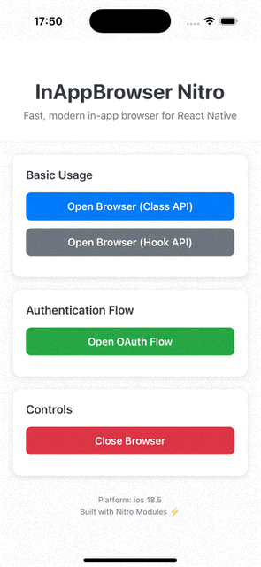

<div align="center">

# react-native-inappbrowser-nitro

**A modern, native in-app browser for React Native — built on [Nitro Modules](https://nitro.margelo.com/).**

[](https://www.npmjs.com/package/react-native-inappbrowser-nitro)
[](https://www.npmjs.com/package/react-native-inappbrowser-nitro)
[](https://bundlephobia.com/package/react-native-inappbrowser-nitro)
[](./LICENSE)
[](https://github.com/mCodex/react-native-inappbrowser-nitro/actions/workflows/ios-build.yml)
[](https://github.com/mCodex/react-native-inappbrowser-nitro/actions/workflows/android-build.yml)

[**Installation**](#installation) ·
[**Quick start**](#quick-start) ·
[**API**](#api) ·
[**Options**](#options) ·
[**Migration**](#migrating-from-react-native-inappbrowser-reborn) ·
[**FAQ**](#faq) ·
[**Changelog**](./CHANGELOG.md)



</div>

---

## ✨ Why this library?

| | |
|---|---|
| ⚡ **Native speed** | Direct JSI bindings via Nitro Modules — no JSON bridge, no scheduler hops. |
| 🎯 **Right primitive on each platform** | `SFSafariViewController` on iOS, Chrome **Custom Tabs** on Android — not a `WKWebView` reimplementation. |
| 🔐 **OAuth-ready** | First-class `openAuth` flow with ephemeral sessions and redirect interception. |
| 🪝 **Hook + imperative APIs** | `useInAppBrowser()` for component state, named exports for everything else. |
| 🧩 **Strict TypeScript** | Discriminated result types, dual `as const` + literal-type enums, full JSDoc with examples. |
| 📦 **Small footprint** | `"sideEffects": false`, ESM-first build, lazy-initialized native module. |

---

## 📋 Requirements

| | Minimum | Tested up to |
|---|---|---|
| React Native | `0.75` (New Architecture) | `0.85` |
| iOS | `15.1` | `26.2` |
| Android | API `23` (Android 6) | API `36` (Android 16) |
| `react-native-nitro-modules` | `0.35` | `0.35.4` |

> [!IMPORTANT]
> This library requires the **React Native New Architecture** and is **not compatible with Expo Go**. It works in [Expo prebuild / dev clients](https://docs.expo.dev/develop/development-builds/introduction/).

---

## 📦 Installation

```sh
yarn add react-native-inappbrowser-nitro react-native-nitro-modules
```

<details>
<summary><strong>npm / pnpm / bun</strong></summary>

```sh
npm install react-native-inappbrowser-nitro react-native-nitro-modules
pnpm add react-native-inappbrowser-nitro react-native-nitro-modules
bun add react-native-inappbrowser-nitro react-native-nitro-modules
```

</details>

### iOS

```sh
cd ios && pod install
```

### Android

Autolinking handles everything. No manual `MainApplication` edits required.

> [!NOTE]
> If you have ProGuard/R8 enabled (release builds), add the following rule to `android/app/proguard-rules.pro` to prevent the native Nitro class from being stripped:
> ```pro
> # react-native-inappbrowser-nitro
> -keep class com.inappbrowsernitro.** { *; }
> ```
> Without this, release builds may crash with `Couldn't find class 'com/inappbrowsernitro/HybridInappbrowserNitro'`.

---

## 🚀 Quick start

### React hook

```tsx
import { useInAppBrowser } from 'react-native-inappbrowser-nitro/hooks'

function DocsButton() {
  const { open, isLoading, error } = useInAppBrowser()

  return (
    <Pressable
      disabled={isLoading}
      onPress={() => open('https://nitro.margelo.com')}
    >
      <Text>{isLoading ? 'Opening…' : 'Open docs'}</Text>
      {error && <Text style={{ color: 'red' }}>{error.message}</Text>}
    </Pressable>
  )
}
```

The hook handles `isLoading` / `error` state, is **safe to call after unmount** (state updates are guarded), and returns stable `open`/`openAuth` references via `useCallback` so it's safe to put them in effect dependency arrays.

### Imperative API

```tsx
import { isAvailable, open } from 'react-native-inappbrowser-nitro'

if (await isAvailable()) {
  const result = await open('https://github.com', {
    preferredBarTintColor:     { light: '#FFFFFF', dark: '#000000' }, // iOS
    toolbarColor:              { light: '#FFFFFF', dark: '#000000' }, // Android
    readerMode: true,
  })

  if (result.type === 'success') {
    console.log('Opened', result.url)
  }
}
```

### OAuth / SSO with `openAuth`

```tsx
import { openAuth } from 'react-native-inappbrowser-nitro'

const result = await openAuth(
  'https://example.com/oauth/authorize?client_id=…&redirect_uri=myapp%3A%2F%2Fcb',
  'myapp://cb',
  {
    ephemeralWebSession: true,   // iOS: don't share cookies with Safari
    enableEdgeDismiss: false,    // iOS: disable swipe-to-dismiss while authing
    forceCloseOnRedirection: true, // Android: close tab once redirect is hit
  }
)

if (result.type === 'success' && result.url) {
  const code = new URL(result.url).searchParams.get('code')
  // …exchange the code for a token
}
```

---

## 📖 API

All exports come from the package root unless noted. Every function returns a `Promise`.

| Export | Signature | Description |
|---|---|---|
| `isAvailable` | `() => Promise<boolean>` | `true` when a compliant Safari/Custom Tabs runtime is reachable. Always `true` on iOS; on Android requires a Custom Tabs–capable browser. |
| `open` | `(url, options?) => Promise<InAppBrowserResult>` | Present an in-app browser. Resolves when the user dismisses or the system closes it. |
| `openAuth` | `(url, redirectUrl, options?) => Promise<InAppBrowserAuthResult>` | Run an authentication session that resolves the moment the native runtime intercepts a navigation matching `redirectUrl`. |
| `close` | `() => Promise<void>` | Dismiss the current browser. No-op when none is presented. |
| `closeAuth` | `() => Promise<void>` | Cancel an in-flight `openAuth` session. |
| `useInAppBrowser` | `() => UseInAppBrowserReturn` | Hook wrapping `open`/`openAuth` with `isLoading` + `error` state. Exported from `react-native-inappbrowser-nitro/hooks`. |

### Result shape

```ts
type BrowserResultType = 'cancel' | 'dismiss' | 'success'

interface InAppBrowserResult {
  type: BrowserResultType
  url?: string      // final URL captured by the browser session
  message?: string  // human-readable reason on `dismiss`
}
```

### Errors

`open` and `openAuth` reject with an `Error` when:

- the URL is empty, missing a scheme, or
- the URL uses a denied scheme (`javascript:`, `data:`, `vbscript:`).

These are sanity checks performed in JS before the call ever crosses JSI.

---

## ⚙️ Options

`open` and `openAuth` accept a single options object that aggregates every iOS and Android knob. **Cross-platform fields** apply everywhere; **`@platform` fields** are silently ignored on the other platform.

### iOS

| Option | Type | Default | Notes |
|---|---|---|---|
| `dismissButtonStyle` | `'done' \| 'close' \| 'cancel'` | `'done'` | Toolbar dismiss button label. |
| `preferredBarTintColor` | `DynamicColor` | system | Toolbar background. **iOS 26 limitation:** see [iOS 26 Liquid Glass](#ios-26-liquid-glass). |
| `preferredControlTintColor` | `DynamicColor` | system | Toolbar button tint. **iOS 26 limitation:** see below. |
| `preferredStatusBarStyle` | `'default' \| 'lightContent' \| 'darkContent'` | system | Status bar appearance while presented. |
| `readerMode` | `boolean` | `false` | Open in Safari Reader Mode if the page supports it. |
| `animated` | `boolean` | `true` | Animate present/dismiss. |
| `modalPresentationStyle` | `ModalPresentationStyle` | `'automatic'` | UIKit modal style. |
| `modalTransitionStyle` | `ModalTransitionStyle` | `'coverVertical'` | UIKit transition (use `'partialCurl'` only with `'fullScreen'`). |
| `modalEnabled` | `boolean` | `true` | Present modally vs. push onto navigation stack. |
| `enableBarCollapsing` | `boolean` | `false` | Collapse toolbar on scroll. |
| `ephemeralWebSession` | `boolean` | `false` | `openAuth` only: don't persist cookies/credentials. |
| `enableEdgeDismiss` | `boolean` | `true` | Allow swipe-from-edge to dismiss. |
| `overrideUserInterfaceStyle` | `'unspecified' \| 'light' \| 'dark'` | `'unspecified'` | Force light/dark regardless of system theme. |
| `formSheetPreferredContentSize` | `{ width, height }` | UIKit | Size when `modalPresentationStyle: 'formSheet'` (iPad). |

### Android

| Option | Type | Default | Notes |
|---|---|---|---|
| `showTitle` | `boolean` | `false` | Show page title beneath URL bar. |
| `toolbarColor` | `DynamicColor` | browser default | Top toolbar background. |
| `secondaryToolbarColor` | `DynamicColor` | browser default | Bottom toolbar background. |
| `navigationBarColor` | `DynamicColor` | system | API 27+. |
| `navigationBarDividerColor` | `DynamicColor` | system | API 28+. |
| `enableUrlBarHiding` | `boolean` | `false` | Hide URL bar on scroll. |
| `enableDefaultShare` | `boolean` | `false` | Show share menu item. Use `shareState` for finer control. |
| `shareState` | `'default' \| 'on' \| 'off'` | `'default'` | Override share menu visibility. |
| `colorScheme` | `'system' \| 'light' \| 'dark'` | `'system'` | Custom Tab theme hint. |
| `headers` | `Record<string, string>` | `{}` | HTTP headers on the initial request. |
| `forceCloseOnRedirection` | `boolean` | `false` | Auto-close tab when redirect URL matches (auth flows). |
| `hasBackButton` | `boolean` | `false` | Show back arrow instead of "X". |
| `browserPackage` | `string` | auto | Pin to a specific browser (e.g. `'com.android.chrome'`). |
| `showInRecents` | `boolean` | `true` | Keep tab in Android Recents after closing. |
| `includeReferrer` | `boolean` | `false` | Send host app's package as `Referrer`. |
| `instantAppsEnabled` | `boolean` | `true` | Allow Instant Apps to handle the URL. |
| `enablePullToRefresh` | `boolean` | `false` | Enable swipe-to-refresh. |
| `enablePartialCustomTab` | `boolean` | `false` | Show as resizable bottom-sheet (Android 13+). |
| `animations` | `BrowserAnimations` | system | Custom enter/exit animation resource names. |

### Dynamic colors

Color options accept a `DynamicColor` object that adapts to system appearance:

```ts
interface DynamicColor {
  base?: string         // fallback for any mode
  light?: string        // light mode override
  dark?: string         // dark mode override
  highContrast?: string // applied when "Increase Contrast" is enabled (iOS 26+, Android 16+)
}
```

Each value is a `#RRGGBB` or `#AARRGGBB` hex string. If a mode-specific value is missing, the platform falls back to `base`, then to the system default.

---

## 🔧 Platform notes

### iOS 26 Liquid Glass

iOS 26 redesigned `SFSafariViewController` around the system **Liquid Glass** material. The toolbar is now a translucent surface that samples content beneath it, so:

- `preferredBarTintColor` has **little to no visible effect** on iOS 26.
- `preferredControlTintColor` is partially overridden by the system's adaptive monochrome treatment — custom tints may render with lower contrast.

This is a platform behavior change that affects every wrapper around `SFSafariViewController`. There is no public API to opt out of the glass material. The properties are still forwarded for iOS ≤ 18 compatibility.

If pixel-exact branding of the chrome is critical, consider a `WKWebView`-based component for non-auth flows. **Do not** use `WKWebView` for OAuth — it does not share Safari's process isolation, cookies, or autofill, and many providers explicitly forbid it.

### Android browser fallback

Android prefers Chrome Custom Tabs when available. On devices without a Custom Tabs–capable browser the system surfaces a chooser via `Intent.ACTION_VIEW`, and option fields like `toolbarColor` are silently ignored.

---

## ❓ FAQ

<details>
<summary><strong>Why not just use <code>WKWebView</code> / <code>react-native-webview</code>?</strong></summary>

`SFSafariViewController` and Chrome Custom Tabs share the system Safari/Chrome session — including cookies, autofill, content blockers, and (critically) password autofill from iCloud Keychain / Google Password Manager. They also run in a separate process from your app, so the host app cannot read page content. This is exactly what most OAuth providers require. A `WKWebView` cannot offer any of that.

</details>

<details>
<summary><strong>Does it work with Expo?</strong></summary>

Yes — in [Expo prebuild / dev client](https://docs.expo.dev/develop/development-builds/introduction/) projects. It does **not** work in Expo Go (managed workflow) because Nitro requires native compilation.

</details>

<details>
<summary><strong>Can I use this with the Old Architecture?</strong></summary>

No. Nitro Modules require the New Architecture (`newArchEnabled=true` on Android, Fabric/TurboModule autolinking on iOS).

</details>

<details>
<summary><strong>"InAppBrowser is not available" on Android emulator</strong></summary>

The default Android emulator image often ships without a Custom Tabs–capable browser. Install Chrome from the Play Store image, or use a Pixel system image with Play Services preinstalled.

</details>

<details>
<summary><strong>Why does my OAuth flow open in Safari on iOS instead of in-app?</strong></summary>

You're probably calling `open` instead of `openAuth`. `openAuth` uses `ASWebAuthenticationSession`, which is the only iOS API allowed to intercept a redirect URL programmatically. `open` uses `SFSafariViewController`, which can't do that.

</details>

<details>
<summary><strong>Result <code>type</code> is <code>'dismiss'</code> right after I call <code>open</code>. Why?</strong></summary>

Most often this means the URL was rejected by the JS-side validator (empty / missing scheme / denied scheme). Check `result.message` for the reason. Logs from the native side are also visible in Xcode / Logcat.

</details>

---

## 🤝 Contributing

Contributions are very welcome. The library is small and well-tested — a great place to land your first React Native PR.

Found a bug or have a feature request? [Open an issue](https://github.com/mCodex/react-native-inappbrowser-nitro/issues/new/choose).

```sh
git clone https://github.com/mCodex/react-native-inappbrowser-nitro
cd react-native-inappbrowser-nitro
yarn install
yarn codegen     # regenerate Nitro bindings + build
yarn typecheck
yarn lint
```

Run the example app:

```sh
cd example
yarn ios       # or: yarn android
```

A `pre-commit` hook (Husky + lint-staged + Biome) auto-formats staged files. CI runs on iOS (`macos-26`, Xcode 26.2) and Android (`ubuntu-latest`, JDK 21).

---

## 📄 License

[MIT](./LICENSE) © [Mateus Andrade](https://github.com/mCodex)
